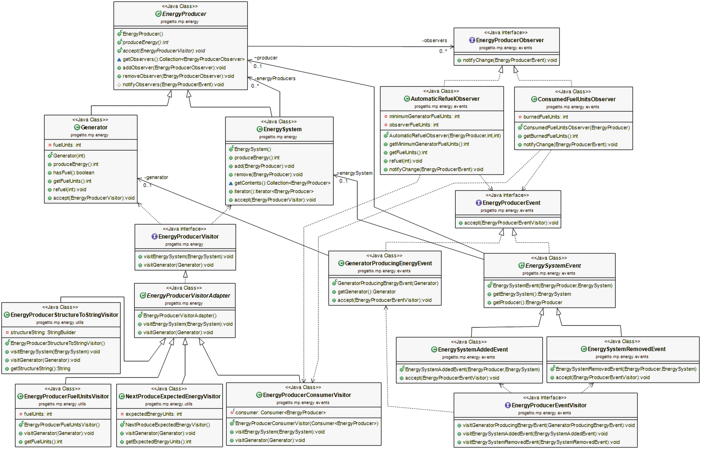

# Java-Design-Patterns
This repository showcases a coherent implementation of four design patterns: Composite, Visitor, Adapter, and Observer. These patterns work together synergistically to demonstrate their practical application and interaction in a real-world scenario. The project aims to enhance code structure, maintainability, and extensibility by leveraging the strengths of each design pattern.

## Key Features
- Implementation of Composite, Visitor, Adapter, and Observer patterns
- Seamless integration of patterns to solve complex problems
- Comprehensive JUnit testing
- Clear documentation

## UML Diagram

